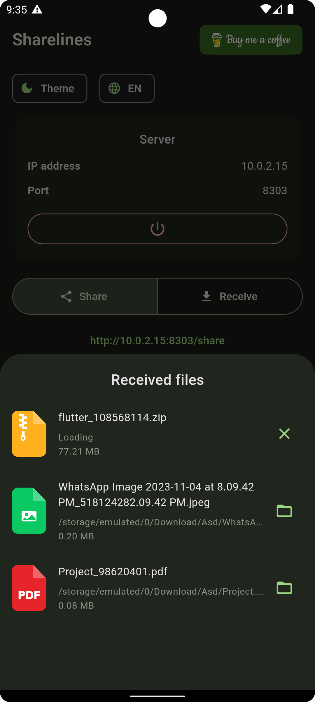

    

Sharelines enhances data sharing by allowing users to effortlessly share files and text across local area networks (
LANs). Unlike traditional sharing methods, only one person needs to have the Sharelines app installed, enabling
hassle-free collaboration.

This is an indie application, it's available in Google Play only by the present time.
Publishing it on the other stores it's a matter of time and account establishment since the codebase consists of the cross-platform code assembled using Flutter Framework.

If you would like to support the project,
feel free to proceed with the button below:

### Authors:

- [Kerim Amansaryyev](https://github.com/kerimamansaryyev)
- [Ilmedova Mahri](https://github.com/ilmedova)

### Key Features:

#### 1. User-Friendly Interface:

Users can easily select the items they want to share with just a few taps.

#### 2. Peer-to-Peer Sharing:

With Sharelines, users can share files and text directly with others on the same local network. There's no need for
external servers or complex setups.

#### 3. Web Browser Access:

The recipient doesn't need to install the Sharelines app. Instead, they can access shared items through a web browser,
making it convenient for collaborators who may not have the app installed.

#### 4. Two-Way Sharing:

Sharelines facilitates two-way communication. Not only can users share files and text, but they can also receive them
through the convenience of a web browser.

### How it Works:

#### 1. Select and Share:

Choose the files or text you want to share within the Sharelines app.

#### 2. Web Browser Access:

Recipients can access shared items through a web browser, eliminating the need for them to install the app.

### Screenshots

    
    
    
    
    
    

>
   
